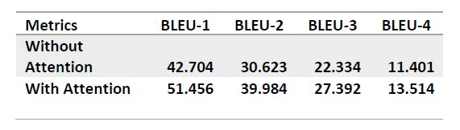
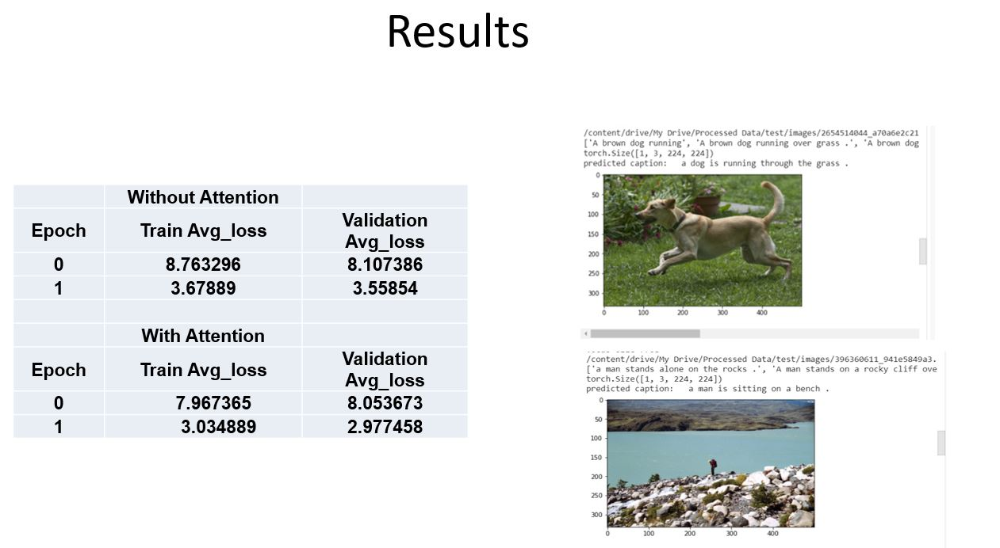

# Automated-Image-Captioning-System

### Table of contents
* [Introduction](#introduction)
* [Problem Statement](#problem-statement)
* [Data Source](#data-source)
* [Technologies](#technologies)
* [Type of Data](#type-of-data)
* [Data Pre-processing](#data-pre-processing)
* [Steps Involved](#steps-involved)
* [Evaluation Metrics](#evaluation-metrics)
* [Results](#results)

### Introduction
Automatically describing the content of an image is one of the challenging problems in Artificial Intelligence where a textual description must be generated for a given image. It requires both methods from computer vision to understand the content of the image and a language model from natural language processing to convert the understanding of the image into words in the correct structure. For this project we have taken Flickr8k dataset which consists of images along with their captions and we implemented our neural network-based image caption generator in Pytorch. For this project we have identified five major components, first one is data pre-processing, second is Encoder part which is the implementation of Convolutional Neural Network model that extracts features from images, third is attention mechanism, fourth is Decoder part which is the implementation of LSTM model which translates the features and objects in the image to a natural sentence and finally using greedy Search we generated the captions for the images. We have chosen BLEU metric to evaluate the quality and the accuracy of the captions generated by the model. We were able to implement the components mentioned above and were able to train our network on Google Colaboratory. Our model was able to achieve a BLEU-4 score of 13.5.

### Problem Statement
* Build an Image Captioning system to generate relevant captions for any given input image.

### Data Source
* Kaggle - Flickr8k dataset

### Technologies
* PyTorch

### Type of Data
* Dataset consists of 8092 images in JPEG format 
* Each input image has 5 captions associated with it
* Train : 6000
* Dev   : 1000
* Test  : 1000

### Data Pre-processing
* Data preprocessing involves loading and resizing image data into (N × 3 × 224 × 224) dimension and normalizing pixel value to be within range [0, 1] with mean value of [0.440,  0.417, 0.384] and std of [0.286, 0.280, 0.290]

### Steps Involved
* We pass the cleaned data of size (N × 3 × 224 × 224) to RESNET-152
* We then pass the CNN output which has dimensions of size (2048 * 1 * 1) to RNN
* For the decoder part, we first tokenized the words and converted to lower cases and then we had to convert all the words into indexes to get the word embeddings
* We constructed a vocabulary of words which consists of frequent words in the training caption data along with which we added few special words like <start>, <end>, <pad>
* We have also added the word <unk> where if the word is not present in the vocabulary it is represented as <unk>
* In the LSTM part of the model, each word in the caption is passed to the model one by one along with the corresponding image
* Initially, the image is passed into the model along with the first word and it is mapped to generate the corresponding second word.
* This process is repeated until <end> is encountered it stops generating sentence and it marks the end of the caption
* Two input arrays are passed into the model, one for passing features of image and the other one for passing text data in encoded format
* The output of the model is the encoded next word of the sequence
* Finally, when the model is used to generate descriptions for an image, the words generated in the previous sequence are concatenated and fed into the model to generate the next word
  
### Evaluation Metrics  
Though we were able to generate the captions, but we were not sure whether the captions generated were correct and are learned as expected and since the data is huge, we cannot possibly show the results for each image. Evaluating the performance of the caption generated is significantly important. Thus, to find the average accuracy on the whole dataset, BLEU-1, BLEU-2, BLEU-3, and BLEU-4 (Bilingual Evaluation Understudy) are metrics we chose to evaluate the quality of the caption generated. Sentences are compared based on modified n-gram precision method for generating BLEU score [5] (modified n-gram precision = maximum number of times n-gram occurs in reference/ total number of n-grams in hypothesis) . For BLEU calculation, each occurrence of an n-gram in ground truth can account for only one occurrence in predicted . Currently, we got a BLEU-4 score achieved with 20 epochs is 11.4 without attention and 13.5 with attention. BLEU scores on test data are mentioned in the below table. 

### Results

